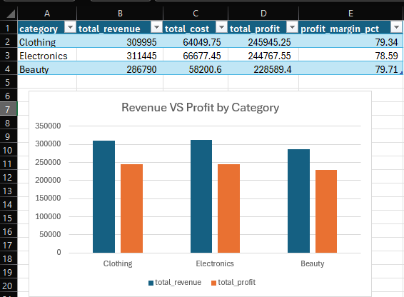
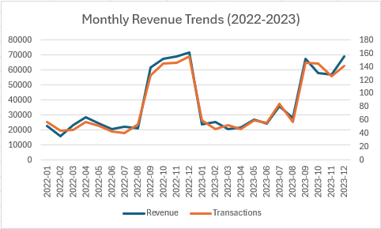

# Retail Sales Performance Analysis

**Tools:** MySQL, Excel
**Skills:** SQL, Data Cleaning, Business Analysis, Data Visualization

---

## Project Summary

This project examines 1,987 retail sales transactions from 2022-2023 to answer three business questions: which products are actually the most profitable, whether sales follow a seasonal pattern, and which customers are the most valuable.

**Dataset:** [Retail Sales Analysis Dataset](https://github.com/najirh/Retail-Sales-Analysis-SQL-Project--P1) — sales across three categories: Electronics, Clothing, and Beauty.

## Process

1. The raw data was loaded into MySQL and checked for missing or bad values.
2. Basic checks were run first — total customers, categories, and transaction counts.
3. SQL queries were written to answer specific business questions, not just describe the data.
4. Key results were charted in Excel to make the findings easier to see.

## Findings

### 1. Electronics has the highest sales, but Clothing makes more profit

| Category | Revenue | Profit | Margin |
|---|---:|---:|---:|
| Electronics | $311,445 | $244,768 | 78.59% |
| Clothing | $309,995 | $245,945 | 79.34% |
| Beauty | $286,790 | $228,589 | 79.71% |

Electronics brings in the most revenue, but Clothing ends up with more profit after costs are subtracted. Beauty has the lowest sales total but the best profit margin.

**Why it matters:** Sales totals alone would suggest Electronics is the top category, but it isn't the most profitable one. Clothing and Beauty deserve more attention than their sales numbers suggest.

### 2. Sales spike sharply in the last few months of the year

Sales nearly triple between August and September, and stay high through December. This pattern repeats almost exactly in both years. Roughly 40% of annual revenue comes from just these four months.

**Why it matters:** A business should plan ahead for this — more inventory, more staff, and a bigger marketing push before Q4, rather than treating every month the same.

### 3. Big spenders and frequent shoppers are not the same customers

| Customer Type | Example | Purchases | Avg. Spend per Purchase |
|---|---|---:|---:|
| Frequent shopper | Customer #3 | 76 | ~$506 |
| Occasional big spender | Customer #87 | 25 | ~$634 |

The top 5 customers by total spending are mostly frequent shoppers, not big per-visit spenders. A separate group of customers shops less often but spends more each time.

**Why it matters:** These are two different types of customers and likely need different approaches — loyalty rewards for frequent shoppers, and higher-value offers for occasional big spenders.

## Recommendations

1. Prioritize categories by profit, not just sales volume.
2. Plan inventory, staffing, and marketing around the Q4 sales spike.
3. Build separate retention strategies for frequent shoppers versus high-value occasional customers.

## Repository Contents

| File | Description |
|---|---|
| `retail_sales.csv` | Source data |
| `sql_queries.sql` | All SQL queries used in this analysis |
| `monthly_revenue_chart.png` | Chart showing the seasonal sales pattern |
| `category_profit_chart.png` | Chart comparing revenue vs. profit by category |

## Next Steps

- Check whether the Q4 sales spike comes from new customers or repeat ones.
- Look at whether age or gender relates to high-value customers.
- Check if certain days of the week sell better within each category.

